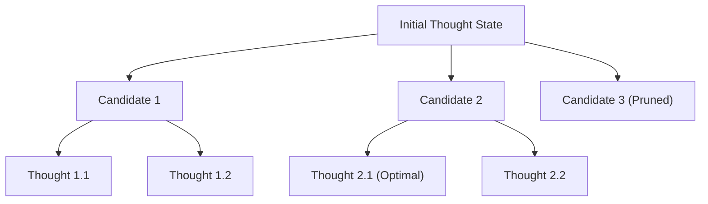

# Tree of Thoughts (ToT) Beam Search Reasoner Skill

High-efficiency, zero-dependency Python implementation of **Tree of Thoughts (ToT)** for deliberate problem solving via lookahead search.

## Features
- **Breadth-First Beam Search Exploration**: Prunes low-confidence branches while maintaining multiple promising hypothesis paths.
- **Evaluation Heuristics**: Dynamically guides agent decision making via state-value estimators.
- **Zero External Dependencies**: Pure Python standard library.
- **Native MCP Protocol**: JSON-RPC 2.0 stdio server compatible with Claude Desktop, Cursor, and Windsurf.

## Architecture

